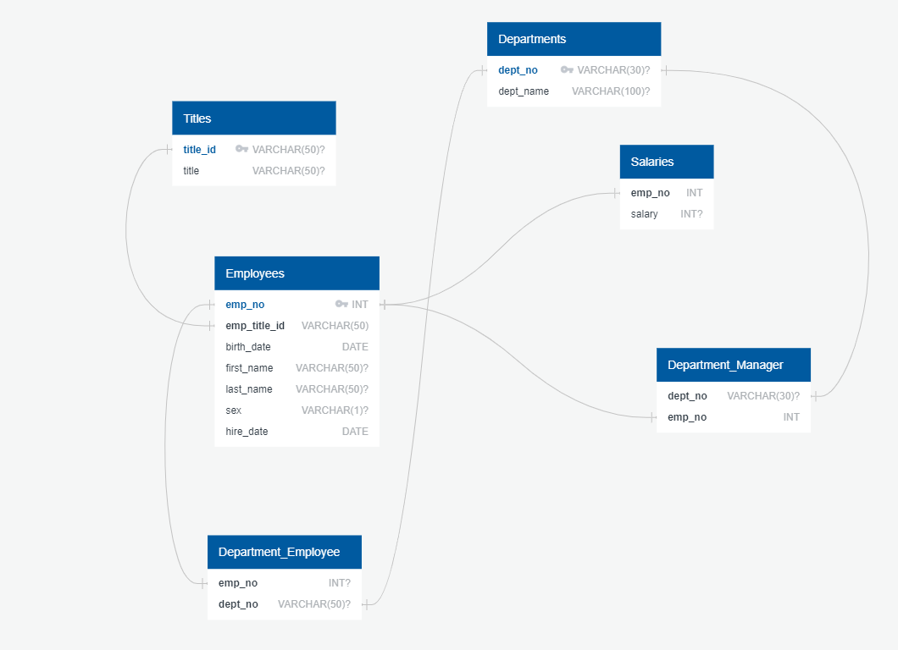
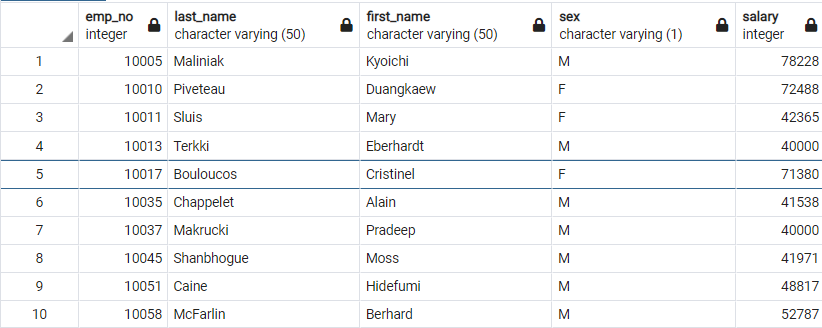
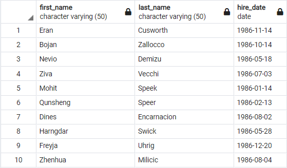
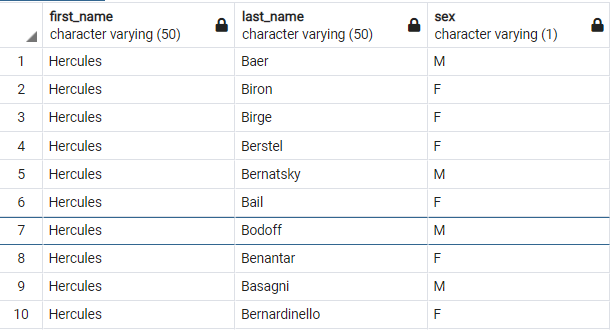
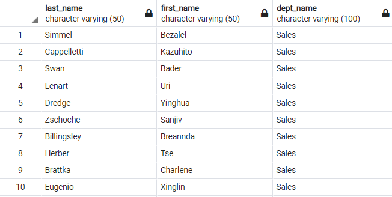
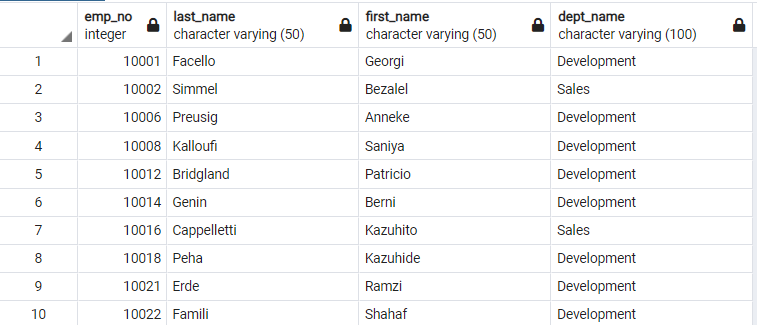
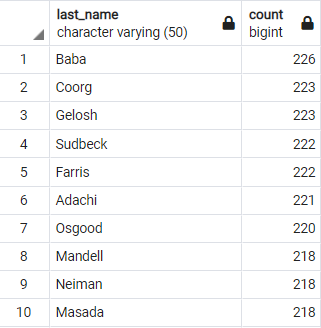
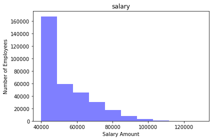
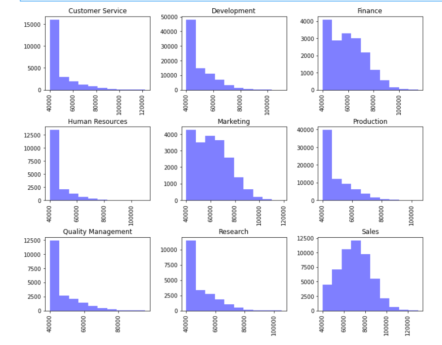
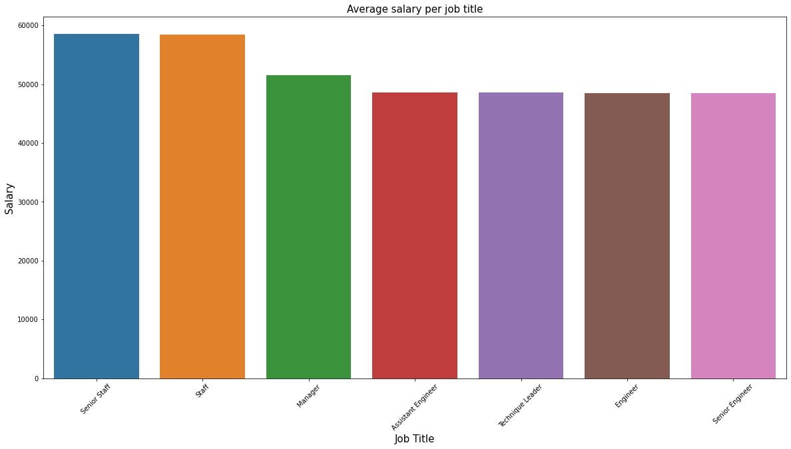

# SQL-Challange-JDAP

## SQL Homework - Employee Database: A Mystery in Two Parts

### Intention of the Repository

This Repository has been made to summit the homework assignment for my Data Science Bootcamp at Northwestern University

SQL challange

Student: Jorge Daniel Atuesta

April, 2021

### Inside of this repository

In this repository, the reader will encounter my solution to the homework assignment SQL-Chalange. The repository is organized in folders and a README.md (The file you are currently reading). Here is the list of the folders and their contents so you can navigate through them.

I hope you find my work not only to be complete but to display all the knowledge learned throughout this portion of the Data Science Bootcamp at Northwestern University.

Folder 1. **Images**: Inside this folder you will find the images for the instructions provided by the institution and the screen shots of the outcome tables for the data analysis portion of the assignment*You can skip this folder if you want*.
Folder 2. **Employee SQL**: Inside this folder, you will have the chance to access my code for the assignment. I encourage you to take a look inside as you will find the solution to the project and screenshots from it. Here is a snapshot of what's inside:

* Folder [data]: Contains all the CSV files that were used during the assignment.
* ERD.png: This is an image showcasing the EDR of the data base that I created. It portrais all the relationships bewteen tables and its a clear diagram of how the data base functions.
* checkin_table_queries.sql: Its a SQL file that contains the code I used to make sure that the CSV files were loaded properly into the tables.
* queries.sql: Its a SQL file containing all the code that I used to be able to satisfy all the eight requierments of the project.
* table schemata.sql: This is a SQL file holding the code to create the tables of the data base.

3. **README.md**: it's the current file you are reading. I strongly suggest navigating through it and look at the project's objective solution and analysis.
4. **BONUS.ipynb**: This is the Jupyter Lab file that I used to create my solution for the bonus question of the assignment.
5. **bonus.csv**: I created this CSV from the query that I made in PgAdmin using SQL. This CSV contains all the information needed to do the bonus portion.

I hope you find my work not only to be complete but to display all the knowledge learned throughout this portion of the Data Science Bootcamp at Northwestern University.

## SQL Project

### Project's Aim

With the data given I was supposed to takel the following three challanges:

1. *Data Modeling*

   1. Create an ERD
2. *Data Engineering*

   1. Create a table schema for each of the files (6 files in total)
   2. Import the CSV into the tables
3. *Data Analysis*

   1. List the following details of each employee: employee number, last name, first name, sex, and salary.
   2. List first name, last name, and hire date for employees who were hired in 1986.
   3. List the manager of each department with the following information: department number, department name, the manager's employee number, last name, first name.
   4. List the department of each employee with the following information: employee number, last name, first name, and department name.
   5. List first name, last name, and sex for employees whose first name is "Hercules" and last names begin with "B."
   6. List all employees in the Sales department, including their employee number, last name, first name, and department name.
   7. List all employees in the Sales and Development departments, including their employee number, last name, first name, and department name.
   8. In descending order, list the frequency count of employee last names, i.e., how many employees share each last name.
   9. Create a histogram to visualize the most common salary ranges for employees.
   10. Create a bar chart of average salary by title.

### Project outcomes

#### Data Modeling

Here is an image of the final ERD created for the project.



#### Data Engineering

```sql
CREATE TABLE "Titles" (
    "title_id" VARCHAR(50)   NULL,
    "title" VARCHAR(50)   NULL,
    CONSTRAINT "pk_Titles" PRIMARY KEY (
        "title_id"
     )
);

CREATE TABLE "Employees" (
    "emp_no" INT   NOT NULL,
    "emp_title_id" VARCHAR(50)   NOT NULL,
    "birth_date" DATE   NOT NULL,
    "first_name" VARCHAR(50)   NULL,
    "last_name" VARCHAR(50)   NULL,
    "sex" VARCHAR(1)   NULL,
    "hire_date" DATE   NOT NULL,
    CONSTRAINT "pk_Employees" PRIMARY KEY (
        "emp_no"
     )
);

CREATE TABLE "Deparments" (
    "dept_no" VARCHAR(30)   NULL,
    "dept_name" VARCHAR(100)   NULL,
    CONSTRAINT "pk_Deparments" PRIMARY KEY (
        "dept_no"
     )
);

CREATE TABLE "Department_Employee" (
    "emp_no" INT   NULL,
    "dept_no" VARCHAR(50)   NULL
);

CREATE TABLE "Department_Manager" (
    "dept_no" VARCHAR(30)   NULL,
    "emp_no" INT   NOT NULL
);

CREATE TABLE "Salaries" (
    "emp_no" INT   NOT NULL,
    "salary" INT   NULL
);

ALTER TABLE "Employees" ADD CONSTRAINT "fk_Employees_emp_title_id" FOREIGN KEY("emp_title_id")
REFERENCES "Titles" ("title_id");

ALTER TABLE "Department_Employee" ADD CONSTRAINT "fk_Department_Employee_emp_no" FOREIGN KEY("emp_no")
REFERENCES "Employees" ("emp_no");

ALTER TABLE "Department_Employee" ADD CONSTRAINT "fk_Department_Employee_dept_no" FOREIGN KEY("dept_no")
REFERENCES "Deparments" ("dept_no");

ALTER TABLE "Department_Manager" ADD CONSTRAINT "fk_Department_Manager_dept_no" FOREIGN KEY("dept_no")
REFERENCES "Departments" ("dept_no");

ALTER TABLE "Department_Manager" ADD CONSTRAINT "fk_Department_Manager_emp_no" FOREIGN KEY("emp_no")
REFERENCES "Employees" ("emp_no");

ALTER TABLE "Salaries" ADD CONSTRAINT "fk_Salaries_emp_no" FOREIGN KEY("emp_no")
REFERENCES "Employees" ("emp_no");
```

#### Data Analysis

Inside the folder EmployeeSQL you can find the query.sql showcasing the code for the following tables:

Part 1: List the following details of each employee: employee number, last name, first name, sex, and salary.



PART 2: List first name, last name, and hire date for employees who were hired in 1986.



PART 3: List the manager of each department with the following information: department number, department name, the manager's employee number, last name, first name.


PART 4: List the department of each employee with the following information: employee number, last name, first name, and department name.


PART 5: List first name, last name, and sex for employees whose first name is "Hercules" and last names begin with "B."



PART 6: List all employees in the Sales department, including their employee number, last name, first name, and department name.



PART 7: List all employees in the Sales and Development departments, including their employee number, last name, first name, and department name.



PART 8: In descending order, list the frequency count of employee last names, i.e., how many employees share each last name



PART 9 Create a histogram to visualize the most common salary ranges for employees.






PART 10 Create a bar chart of average salary by title.




## References

Littel, T. (2021, April 15). Tutoring session March 24th 2021. (J. D. Atuesta, Interviewer)

## Assignment instructions provided by Northwestern Data Science Bootcamp

### SQL Homework - Employee Database: A Mystery in Two Parts


#### Background

It is a beautiful spring day, and it is two weeks since you have been hired as a new data engineer at Pewlett Hackard. Your first major task is a research project on employees of the corporation from the 1980s and 1990s. All that remain of the database of employees from that period are six CSV files.

In this assignment, you will design the tables to hold data in the CSVs, import the CSVs into a SQL database, and answer questions about the data. In other words, you will perform:

1. Data Engineering
2. Data Analysis

Note: You may hear the term "Data Modeling" in place of "Data Engineering," but they are the same terms. Data Engineering is the more modern wording instead of Data Modeling.

#### Before You Begin

1. Create a new repository for this project called `sql-challenge`. **Do not add this homework to an existing repository**.
2. Clone the new repository to your computer.
3. Inside your local git repository, create a directory for the SQL challenge. Use a folder name to correspond to the challenge: **EmployeeSQL**.
4. Add your files to this folder.
5. Push the above changes to GitHub.

### Instructions

##### Data Modeling

Inspect the CSVs and sketch out an ERD of the tables. Feel free to use a tool like [http://www.quickdatabasediagrams.com](http://www.quickdatabasediagrams.com).

##### Data Engineering

* Use the information you have to create a table schema for each of the six CSV files. Remember to specify data types, primary keys, foreign keys, and other constraints.

  * For the primary keys check to see if the column is unique, otherwise create a [composite key](https://en.wikipedia.org/wiki/Compound_key). Which takes to primary keys in order to uniquely identify a row.
  * Be sure to create tables in the correct order to handle foreign keys.
* Import each CSV file into the corresponding SQL table. **Note** be sure to import the data in the same order that the tables were created and account for the headers when importing to avoid errors.

##### Data Analysis

Once you have a complete database, do the following:

1. List the following details of each employee: employee number, last name, first name, sex, and salary.
2. List first name, last name, and hire date for employees who were hired in 1986.
3. List the manager of each department with the following information: department number, department name, the manager's employee number, last name, first name.
4. List the department of each employee with the following information: employee number, last name, first name, and department name.
5. List first name, last name, and sex for employees whose first name is "Hercules" and last names begin with "B."
6. List all employees in the Sales department, including their employee number, last name, first name, and department name.
7. List all employees in the Sales and Development departments, including their employee number, last name, first name, and department name.
8. In descending order, list the frequency count of employee last names, i.e., how many employees share each last name.

### Bonus (Optional)

As you examine the data, you are overcome with a creeping suspicion that the dataset is fake. You surmise that your boss handed you spurious data in order to test the data engineering skills of a new employee. To confirm your hunch, you decide to take the following steps to generate a visualization of the data, with which you will confront your boss:

1. Import the SQL database into Pandas. (Yes, you could read the CSVs directly in Pandas, but you are, after all, trying to prove your technical mettle.) This step may require some research. Feel free to use the code below to get started. Be sure to make any necessary modifications for your username, password, host, port, and database name:

   ```sql
   from sqlalchemy import create_engine
   engine = create_engine('postgresql://localhost:5432/<your_db_name>')
   connection = engine.connect()
   ```

* Consult [SQLAlchemy documentation](https://docs.sqlalchemy.org/en/latest/core/engines.html#postgresql) for more information.
* If using a password, do not upload your password to your GitHub repository. See [https://www.youtube.com/watch?v=2uaTPmNvH0I](https://www.youtube.com/watch?v=2uaTPmNvH0I) and [https://help.github.com/en/github/using-git/ignoring-files](https://help.github.com/en/github/using-git/ignoring-files) for more information.

2. Create a histogram to visualize the most common salary ranges for employees.
3. Create a bar chart of average salary by title.

### Epilogue

Evidence in hand, you march into your boss's office and present the visualization. With a sly grin, your boss thanks you for your work. On your way out of the office, you hear the words, "Search your ID number." You look down at your badge to see that your employee ID number is 499942.

### Submission

* Create an image file of your ERD.
* Create a `.sql` file of your table schemata.
* Create a `.sql` file of your queries.
* (Optional) Create a Jupyter Notebook of the bonus analysis.
* Create and upload a repository with the above files to GitHub and post a link on BootCamp Spot.
* Ensure your repository has regular commits (i.e. 20+ commits) and a thorough README.md file

### Copyright

Trilogy Education Services © 2019. All Rights Reserved.
